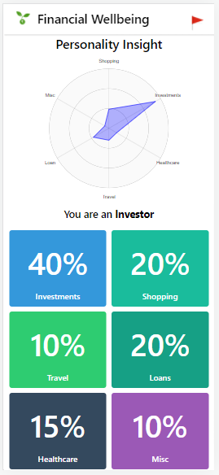
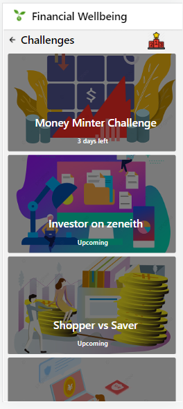
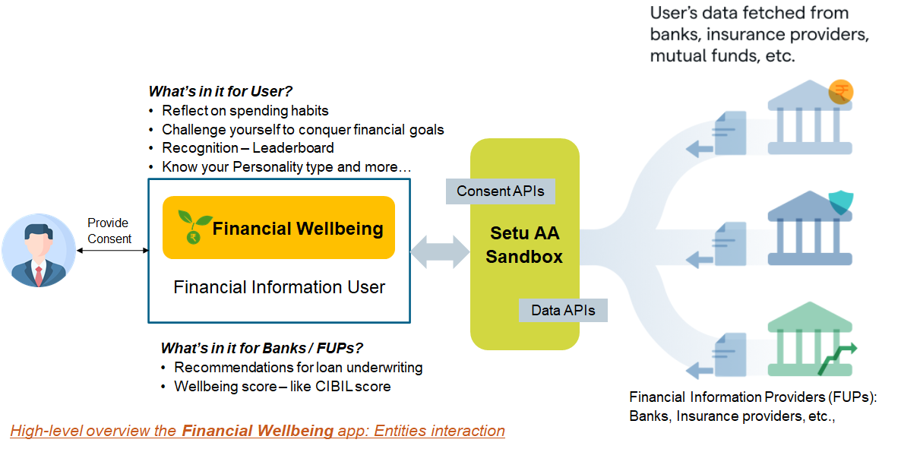

# Financial Wellbeing for Everyone
Reflect on your habits - learn from the spending patterns, create personalized value-add based on the payment categorization data for users and financial information providers eventually

- **Mobile app**: Built with React Native
- **Server-side backend**: Built with Node.js (Express)

 
## Demo Video

## Overview

## Credits  
This code base is inspired from [example - Account Aggregator sample app](https://github.com/SetuHQ/account-aggregator-sample-app) 

## References

* [PhonePe Pulse](https://github.com/PhonePe/pulse)
* [Aggregrator-SETU](https://setu.co/data/account-aggregator)
* [Docs](https://docs.setu.co/data/account-aggregator/overview)
* [Slack community](https://join.slack.com/t/setuaccountaggregator/shared_invite/zt-tt9nd4rn-rn7lWSSe8ABPkSh~G0mc_g)

